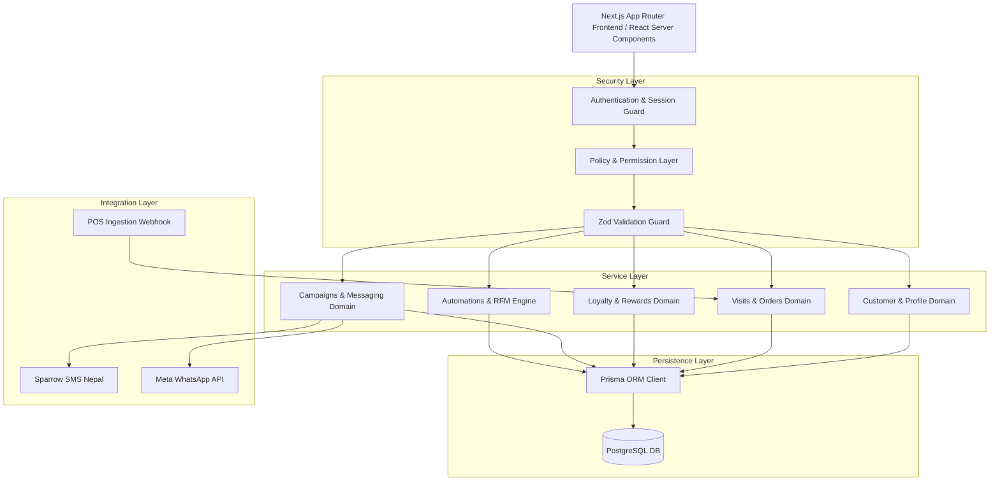
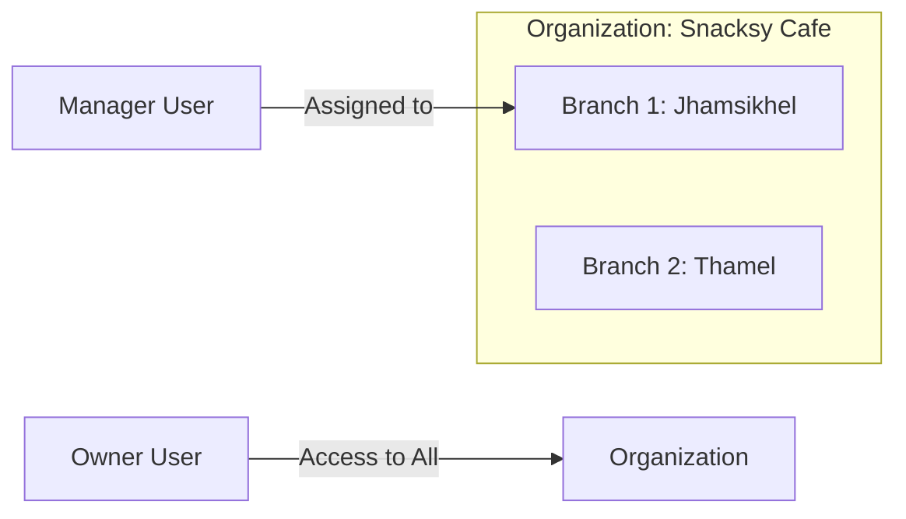

# Target Architecture Document: Snacksy Cafe And Restro CRM

## 1. System Overview & Context
**Client**: Snacksy Cafe And Restro  
**Type**: Cafe & Restaurant CRM  
**Country**: Nepal  
**Currency**: NPR (`रू`)  
**Timezone**: `Asia/Kathmandu` (UTC +05:45)  

The Snacksy Cafe And Restro CRM is a multi-tenant, multi-branch, high-performance customer relationship management system designed specifically for the hospitality sector in Nepal.

---

## 2. High-Level Architecture Diagram

---

## 3. Layer Breakdown

### 3.1 Frontend Architecture
- **Framework**: Next.js 14+ App Router with React Server Components (RSC) for initial page renders and low-latency server rendering.
- **Styling**: Tailwind CSS with CSS variables for responsive theme customization.
- **UI Components**: `shadcn/ui` primitive pattern built on top of Radix UI primitives and Lucide icons.
- **Form Management**: `react-hook-form` coupled with `@hookform/resolvers/zod` for type-safe client-side validation.
- **State Management**: Server state managed via Next.js cache revalidation (`revalidatePath`, `revalidateTag`), and client UI state contained in React local state or lightweight context providers.

### 3.2 Backend & Service Layer Architecture
- **API Interfaces**: Next.js Server Actions for interactive form submissions and mutations; Next.js Route Handlers (`/api/...`) for webhook ingestion and external integration payloads.
- **Domain Services**: Decoupled domain service modules (e.g. `src/server/services/customer.service.ts`) encapsulating business logic, calculation engines (RFM, loyalty points), and audit logging.
- **Repositories**: Database abstraction layer (e.g. `src/server/repositories/customer.repository.ts`) enforcing multi-tenant filter constraints on every Prisma query.
- **Authorization Policies**: Centralized policy evaluation functions (e.g. `src/server/policies/customer.policy.ts`) executed before any domain operation.

### 3.3 Database Layer Architecture
- **ORM**: Prisma ORM with strict TypeScript model generation.
- **Database Engine**: PostgreSQL with explicit indexing on tenant IDs (`organizationId`), branch IDs (`branchId`), phone numbers, and status columns.
- **Data Precision**: Financial figures (prices, spends, subtotals, taxes, discounts) are strictly stored as integer subunit values (Paisa, where `1 NPR = 100 Paisa`) or high-precision Decimal types to eliminate floating-point rounding errors.

---

## 4. Multi-Tenant & Branch Architecture

- **Organization Isolation**: Every database entity (Customers, Loyalty Accounts, Campaigns, Tasks) is bound to an `organizationId`. Repositories mandate `organizationId` parameter filtering to guarantee data isolation.
- **Branch Scope**: Operational records (Visits, Orders, Reservations, Tables, Feedback) are scoped to a specific `branchId`. Users are granted access to specific branches (`UserBranch`), allowing front-desk personnel to view only their branch's activity while managers/owners view aggregate organizational data.

---

## 5. Security, Auth & RBAC Boundaries

- **Authentication**: JWT-based session state or encrypted HTTP-only session cookies. Passwords hashed using bcrypt/Argon2.
- **RBAC Model**: Capability/Permission-based design. Roles (Owner, Manager, Marketing, Front Desk, Staff, Read-Only) are mappings of standard granular permission strings (`customer.create`, `loyalty.adjust`, `report.export`).
- **Boundary Checks**:
  1. Session check: Ensure `UserContext` exists.
  2. Organization guard: Validate `user.organizationId == request.organizationId`.
  3. Permission guard: Evaluate `user.permissions.includes(requiredPermission)`.
  4. Branch guard: Validate `user.branchIds.includes(request.branchId)`.

---

## 6. Background Jobs, Integrations & Webhooks

- **Background Processing**: Asynchronous tasks (e.g. campaign dispatching, daily RFM score updates, birthday notifications) executed via Next.js scheduled cron jobs / queue handlers.
- **Nepal SMS & Messaging**: Native integration drivers for **Sparrow SMS** / **Aakash SMS** (Nepal local SMS gateways) and **Meta WhatsApp Business API**.
- **Idempotent Webhooks**: POS and payment webhooks validate cryptographic signature headers, store raw events in `webhook_events`, and enforce idempotency checking on external event IDs.

---

## 7. Observability & Audit Logging

- **Audit Logs**: Critical administrative and data-modifying events (`customer.merge`, `loyalty.adjust`, `role.update`) emit entries into `audit_logs` capturing `userId`, `action`, `resourceId`, timestamp, and change details.
- **Logging**: Structured JSON logger formatting errors with trace IDs.
- **Error Tracking**: Integration point prepared for Sentry error logging on client and server.

---

## 8. Deployment & Environment Strategy

- **Application Hosting**: Containerized Docker image or Vercel production hosting.
- **Database Hosting**: Managed PostgreSQL (e.g. Supabase, Neon, AWS RDS PostgreSQL).
- **Timezone Enforcement**: Runtime configured for `Asia/Kathmandu` (`UTC+05:45`). All stored database timestamps are in UTC ISO 8601; formatted to Asia/Kathmandu at client/UI layer.
