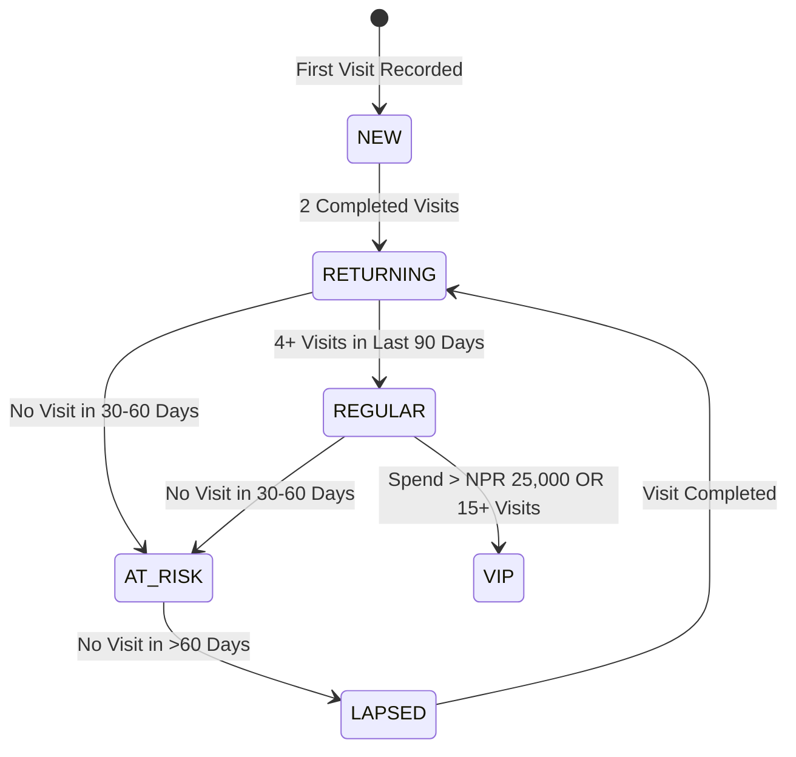

# CRM Business Rules & Thresholds Specification: Snacksy Cafe And Restro

## 1. Executive Summary
This document specifies all domain business rules, customer lifecycle state transitions, RFM segmentation algorithms, and loyalty earning logic for **Snacksy Cafe And Restro**. All numerical thresholds defined here are stored dynamically in `organization_settings` and can be adjusted per organization.

---

## 2. Customer Lifecycle Stages

### 2.1 Customer Stage Definitions & Default Thresholds

| Lifecycle Stage | Default Rule Definition | Configurable Parameter Key |
| :--- | :--- | :--- |
| **New Customer** | Customer created; exactly `1` completed visit recorded. | N/A |
| **Returning Customer** | Total completed visits `≥ 2`. | `returningVisitsMin` (Default: 2) |
| **Regular Customer** | Total completed visits `≥ 4` within the trailing `90` days. | `regularVisitsMin` (Default: 4), `regularDaysWindow` (Default: 90) |
| **VIP Customer** | Total lifetime spend `≥ NPR 25,000` (`2,500,000 Paisa`) OR total visits `≥ 15`. | `vipMinSpendNpr` (Default: 25,000), `vipMinVisits` (Default: 15) |
| **At Risk** | Days since last visit between `30` and `60` days. | `atRiskDaysMin` (Default: 30), `atRiskDaysMax` (Default: 60) |
| **Lapsed Customer** | Days since last visit `> 60` days. | `lapsedDaysMin` (Default: 60) |
| **Birthday Soon** | Customer's `dateOfBirth` day and month fall within `+7` days from today. | `birthdayNoticeDays` (Default: 7) |
| **Negative Feedback** | Rating submitted `≤ 2` out of `5` stars. | `negativeRatingMax` (Default: 2) |

---

## 3. Core Metrics Calculations

### 3.1 Repeat Customer Rate
$$\text{Repeat Customer Rate} = \left( \frac{\text{Total Customers with } \ge 2 \text{ Visits}}{\text{Total Customer Base}} \right) \times 100$$

### 3.2 Lifetime Spend (NPR)
Total sum of all completed order totals for a customer:
$$\text{Lifetime Spend} = \sum \text{Order.totalAmountNpr}$$
*Represented in Paisa in DB, converted to NPR for display.*

### 3.3 Visit Frequency
Average days between consecutive customer visits:
$$\text{Visit Frequency} = \frac{\text{Days Between First & Last Visit}}{\text{Total Visits} - 1}$$

---

## 4. RFM (Recency, Frequency, Monetary) Scoring Engine

RFM scores range from `1` (lowest) to `5` (highest) across three dimensions:

| Score | Recency (Days Since Last Visit) | Frequency (Total Completed Visits) | Monetary (Lifetime Spend NPR) |
| :---: | :---: | :---: | :---: |
| **5** | 0 – 14 days | 10+ visits | ≥ NPR 20,000 |
| **4** | 15 – 30 days | 6 – 9 visits | NPR 10,000 – 19,999 |
| **3** | 31 – 60 days | 3 – 5 visits | NPR 5,000 – 9,999 |
| **2** | 61 – 90 days | 2 visits | NPR 2,000 – 4,999 |
| **1** | > 90 days | 1 visit | < NPR 2,000 |

---

## 5. Loyalty & Rewards Program Rules

### 5.1 Loyalty Earning Rules
- **Base Earning**: Customers earn `1 Loyalty Point` per `NPR 100` (`10,000 Paisa`) spent on completed orders.
- **Visit Bonus**: Flat `10 Loyalty Points` earned per verified completed visit.

### 5.2 Reward Redemption Rules
- Rewards have fixed point requirements (e.g. `100 Points` = Free Coffee / Dessert).
- Redemptions generate a unique single-use code (`RewardRedemption.code`) verified at POS checkout.
- Accounts cannot maintain negative points balances.

---

## 6. Campaign & Automation Attribution
- **Attribution Window**: A visit or order is attributed to a marketing campaign if completed within `7 days` (`campaignAttributionDays`) of receiving a campaign message (SMS/WhatsApp).
