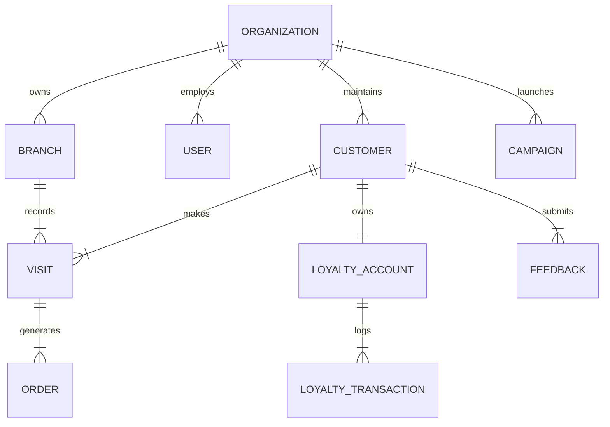

# Database Specification & Schema Design: Snacksy Cafe And Restro CRM

## 1. Overview & Key Strategies

### 1.1 Tenant & Branch Isolation
- **Organization Tenant Isolation**: All core entities (`Customer`, `Tag`, `RestaurantTable`, `LoyaltyAccount`, `Segment`, `Campaign`, `Automation`, `Task`, `AuditLog`) maintain a direct `organizationId` foreign key referencing `Organization`.
- **Branch Scope**: Operational records (`Visit`, `Order`, `Reservation`, `WaitlistEntry`, `Feedback`) maintain a `branchId` foreign key referencing `Branch`.

### 1.2 Financial Precision Strategy (NPR Currency)
- **Currency**: Nepali Rupee (`NPR`, symbol `रू`).
- **Storage Subunit**: To prevent IEEE 754 floating-point precision loss, all monetary amounts (`totalSpendNpr`, `subtotalNpr`, `taxNpr`, `discountNpr`, `totalAmountNpr`, `unitPriceNpr`, `totalPriceNpr`) are stored as **32-bit/64-bit Integers in Paisa** (where `1 NPR = 100 Paisa`).
  - Example: `NPR 250.50` is stored as `25050` Paisa.

### 1.3 Timezone Strategy
- **Application Default Timezone**: `Asia/Kathmandu` (UTC +05:45 offset).
- **Database Storage**: All `DateTime` columns are stored in **UTC ISO 8601** timestamp format (`TIMESTAMPTZ` in PostgreSQL).
- **Presentation Layer**: Conversions to local Nepal time (`Asia/Kathmandu`) occur in display formatters and reporting aggregators.

### 1.4 Phone Number Normalization Strategy
- **Standard Format**: International E.164 standard format.
- **Default Country Code**: Nepal (`+977`).
- **Normalization Rules**:
  - `9841234567` -> Normalized to `+9779841234567`.
  - `01-4234567` -> Normalized to `+97714234567`.
- **Constraint**: Customer phones are strictly unique per organization (`@@unique([organizationId, phone])`).

---

## 2. Entity Specifications & Relationships

### 2.1 Core System & Authentication
- `organizations`: Root tenant container (`id`, `name`, `slug`, `timezone`, `currency`).
- `branches`: Location units within an organization (`id`, `organizationId`, `name`, `code`, `city`).
- `users`: Staff and admin user accounts (`id`, `organizationId`, `email`, `passwordHash`, `fullName`).
- `roles`: Role definitions (`id`, `organizationId`, `name`, `isSystemRole`).
- `permissions`: Master list of system permissions (`id`, `code`, `description`, `category`).
- `role_permissions`: Join table mapping permissions to roles.
- `user_roles`: Join table mapping roles to users.
- `user_branches`: Join table defining which branches a user can access.

### 2.2 Customer 360 & Profiles
- `customers`: Core customer profiles (`id`, `organizationId`, `firstName`, `lastName`, `phone`, `email`, `lifecycleStage`, `totalVisits`, `totalSpendNpr`, `lastVisitAt`, `mergedIntoId`).
- `customer_preferences`: Dietary preferences, seating habits (`customerId`, `dietaryRestrictions`, `preferredSeating`, `favoriteItems`, `marketingOptInSms`).
- `customer_notes`: Staff notes on customer profile (`id`, `customerId`, `authorId`, `content`, `isImportant`).
- `tags`: Organizational customer tags (`id`, `organizationId`, `name`, `colorHex`).
- `customer_tags`: Join table connecting customers and tags.
- `consent_events`: Compliance opt-in/opt-out logs (`id`, `customerId`, `channel`, `granted`, `source`).

### 2.3 Operations & Floor Management
- `visits`: Track customer visits (`id`, `branchId`, `customerId`, `partySize`, `tableNumber`, `checkInAt`, `checkOutAt`, `status`).
- `orders`: POS order headers (`id`, `branchId`, `customerId`, `visitId`, `orderNumber`, `subtotalNpr`, `taxNpr`, `discountNpr`, `totalAmountNpr`, `paymentMethod`, `status`).
- `order_items`: Order detail line items (`id`, `orderId`, `itemName`, `quantity`, `unitPriceNpr`, `totalPriceNpr`).
- `restaurant_tables`: Physical tables in branch (`id`, `branchId`, `tableNumber`, `capacity`, `section`).
- `reservations`: Bookings (`id`, `branchId`, `customerId`, `tableId`, `reservationTime`, `partySize`, `status`).
- `waitlist_entries`: Walk-in queue entries (`id`, `branchId`, `customerId`, `partySize`, `quotedWaitMin`, `status`).

### 2.4 Loyalty & Gamification
- `loyalty_accounts`: Customer point balance (`id`, `organizationId`, `customerId`, `currentTierId`, `pointsBalance`, `lifetimePoints`).
- `loyalty_tiers`: Tier definitions (`id`, `organizationId`, `name`, `minPoints`).
- `loyalty_transactions`: Ledger of points earned/spent (`id`, `loyaltyAccountId`, `points`, `type`, `referenceId`).
- `rewards`: Redeemable offers (`id`, `organizationId`, `title`, `pointsRequired`, `isActive`).
- `reward_redemptions`: Claimed reward vouchers (`id`, `loyaltyAccountId`, `rewardId`, `code`, `status`).

### 2.5 Segments, Campaigns & Automations
- `segments`: Dynamic & static target groups (`id`, `organizationId`, `name`, `isDynamic`).
- `segment_rules`: Filtering logic (`id`, `segmentId`, `field`, `operator`, `value`).
- `campaigns`: Outbound message campaigns (`id`, `organizationId`, `segmentId`, `name`, `channel`, `status`).
- `campaign_messages`: Individual recipient dispatch logs (`id`, `campaignId`, `recipient`, `content`, `status`).
- `message_events`: Delivery & open webhook receipts (`id`, `messageId`, `eventType`, `timestamp`).
- `automations`: Trigger-action workflows (`id`, `organizationId`, `name`, `triggerEvent`, `isActive`).
- `automation_runs`: Execution logs (`id`, `automationId`, `status`, `logs`).

### 2.6 Feedback, Tasks & Governance
- `feedback`: Customer ratings & reviews (`id`, `branchId`, `customerId`, `rating`, `comment`, `isNegative`, `status`).
- `feedback_resolutions`: Resolution tracking for low ratings (`id`, `feedbackId`, `resolvedBy`, `notes`).
- `tasks`: Action items for staff (`id`, `organizationId`, `customerId`, `assignedToId`, `createdById`, `title`, `status`).
- `customer_interactions`: Touchpoint log (`id`, `customerId`, `type`, `summary`, `occurredAt`).
- `integration_connections`: SMS/WhatsApp API keys (`id`, `organizationId`, `provider`, `credentials`).
- `webhook_events`: Inbound POS payload queue (`id`, `connectionId`, `eventType`, `payload`, `processed`).
- `import_jobs`: CSV import tracking (`id`, `organizationId`, `filename`, `totalRows`, `processedRows`, `status`).
- `audit_logs`: Security & mutation audit trail (`id`, `organizationId`, `userId`, `action`, `resource`, `resourceId`, `details`).
- `organization_settings`: Dynamic organization business rules (`organizationId`, `atRiskDaysThreshold`, `lapsedDaysThreshold`, `regularVisitsThreshold`).
- `branch_settings`: Location specific configs (`branchId`, `openingHours`, `tableAutoAssignment`).

---

## 3. Indexes & Performance Optimization
- `customers`: `@@index([organizationId, lifecycleStage])`, `@@index([organizationId, phone])`.
- `visits`: `@@index([branchId, checkInAt])`, `@@index([customerId])`.
- `orders`: `@@index([branchId, createdAt])`, `@@index([customerId])`.
- `audit_logs`: `@@index([organizationId, createdAt])`.

---

## 4. Customer Duplicate & Merge Strategy
1. **Deduplication Hook**: On customer creation/import, the service checks for existing matches on normalized `phone` or `email` within the same `organizationId`.
2. **Merge Algorithm**:
   - Primary record retained. Secondary record `mergedIntoId` set to primary `id`.
   - Visits, Orders, Loyalty Accounts, and Feedback associated with secondary record are re-linked to the primary customer `id`.
   - Financial totals (`totalSpendNpr`) and `totalVisits` are recalculated and combined.
   - An audit record `action: "customer.merge"` is recorded in `audit_logs`.
